# SIMAPy

SIMA has an easy-to-use graphical user interface for modelling,
however graphical user interfaces can be inefficient for repetitive tasks or
modelling of large systems with many similar components. 
SIMAPy together with SIMA's JSON export/import functionality and SIMA Runtime Engine (SRE) can ease this process. 


## JSON Export

All of SIMAs models can be represented in the [JSON](https://www.json.org/json-en.html) format.

In SIMA you can right click any model in the navigator 
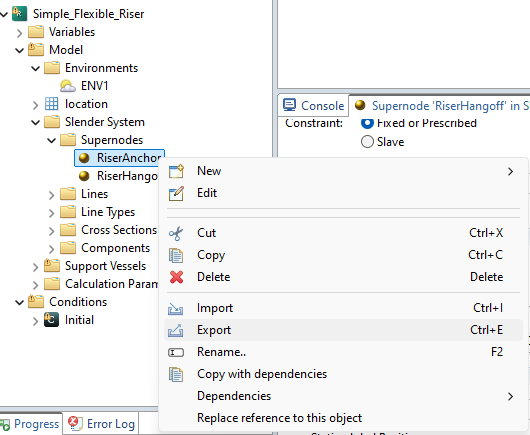

and then select Export-JSON model export

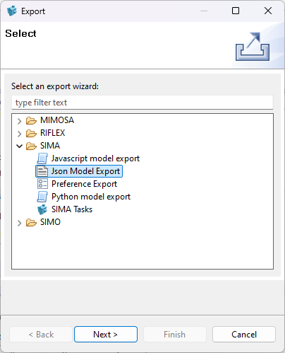

The result can be inspected and edited in a regular text editor.

supernode.json:
```json
{
    "name" : "RiserAnchor",
    "type" : "sima/riflex/SuperNode",
    "constraint" : "FIXED_PRESCRIBED",
    "automaticInitialPosition" : false,
    "xConstraint" : "FIXED",
    "yConstraint" : "FIXED",
    "zConstraint" : "FIXED",
    "rxConstraint" : "FIXED",
    "ryConstraint" : "FIXED",
    "rzConstraint" : "FIXED",
    "xInitial" : 0.0,
    "yInitial" : 0.0,
    "zInitial" : -50.0,
    "xStatic" : 0.0,
    "yStatic" : 0.0,
    "zStatic" : -100.0
}
```

The JSON file is backwards compatible, meaning future official versions of SIMA will be able to read it.


## Python Export

It is also possible to export the models as pure Python code.
The exported code will recreate the model when running the script.

Right click Supernode and choose Export - Python model export

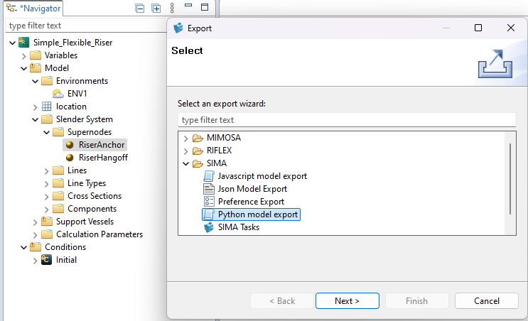

supernode.py:
```python
import simapy.sima.riflex as riflex
riseranchor = riflex.SuperNode()
riseranchor.name = "RiserAnchor"
riseranchor.xConstraint = riflex.BoundaryCondition.FIXED
riseranchor.yConstraint = riflex.BoundaryCondition.FIXED
riseranchor.zConstraint = riflex.BoundaryCondition.FIXED
riseranchor.rxConstraint = riflex.BoundaryCondition.FIXED
riseranchor.ryConstraint = riflex.BoundaryCondition.FIXED
riseranchor.rzConstraint = riflex.BoundaryCondition.FIXED
riseranchor.zInitial = -50.0
riseranchor.zStatic = -100.0
riseranchor.rotation = -90.0

```

We can use Python and JSON export on any level in the Navigator
* Single model-element
* Multiple model-elements (ctrl-click or folder icon)
* Whole task


## JSON Import in SIMAPy

The exported JSON file from SIMA can again be imported in Python.
Here we can see an example reading the Super Node from file and then we create several 
Supernodes by copying the first and write back to JSON for SIMA to import.

```python
import numpy as np
from simapy.sima.riflex.supernode import SuperNode
from simapy.sima_reader import SIMAReader
from simapy.sima_writer import SIMAWriter
#SIMAReader will read the JSON file and return a list of Python objects
reader = SIMAReader()
contents = reader.read('supernode.json')
base_sn: SuperNode = contents[0]
supernodes = []
for i, x in enumerate(np.linspace(0.0, 10.0, 6)):
    # Copy imported supernode as starting point
    sn = base_sn.copy()
    # Adjust static position and name
    sn.xStatic = x
    sn.name = f'Anchor{i}'
    supernodes.append(sn)
# SIMAWriter will write the list of Python objects to a JSON file
writer = SIMAWriter()
writer.write(supernodes, 'supernodes.json')
```

After running the script locally, the JSON file can be imported into SIMA.
Select parent Slender System in the RIFLEX Task then right click and choose Import - Import from JSON
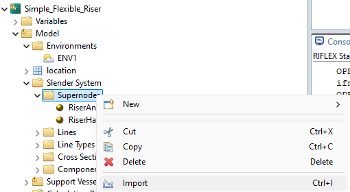

Resulting model after import:

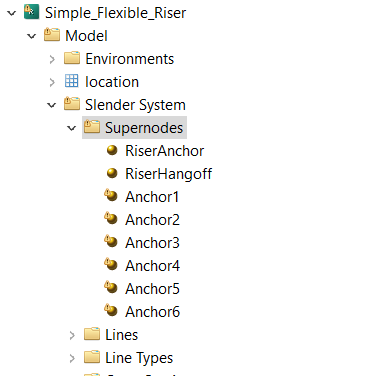

### JSON vs. Python backwards compatibility

* The Python code itself is not backwards compatible. This feature is handled by the JSON file migration within SIMA
    * Python code based on SIMA 4.2.0 will mostly work with SIMA 4.4.0, but there will be some differences that must be manually migrated. The SIMA data model has changed in SIMA 4.4.0, and some attributes have been removed or renamed.
* The migration of JSON files is currently only supported in SIMA
    * This means opening a SIMA 4.2.0 based JSON file in SIMAPy supporting SIMA 4.4.0 will not work 
* Since the JSON file is backwards compatible within SIMA, a python code based on SIMApy 4.2.0 will still work when exporting a JSON file into never versions of SIMA.


## SIMA Data model

How do we know which attributes we can set when coding models in Python?
All SIMA elements are based on an underlying data model.

Super Node editor:

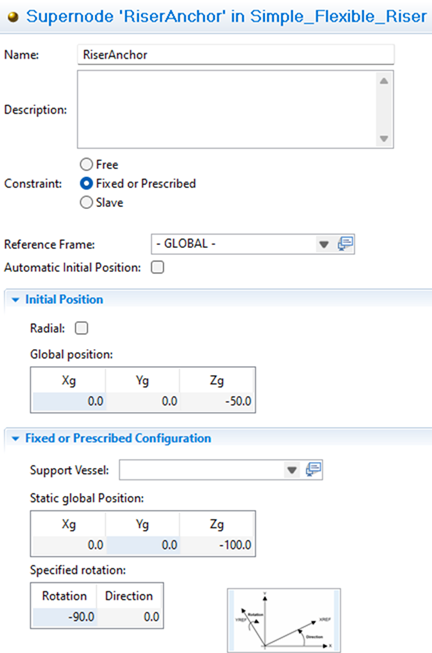

This model can be viewed in SIMA by going to menu Tools - Advanced - Show SIMA datamodel

Super node model:
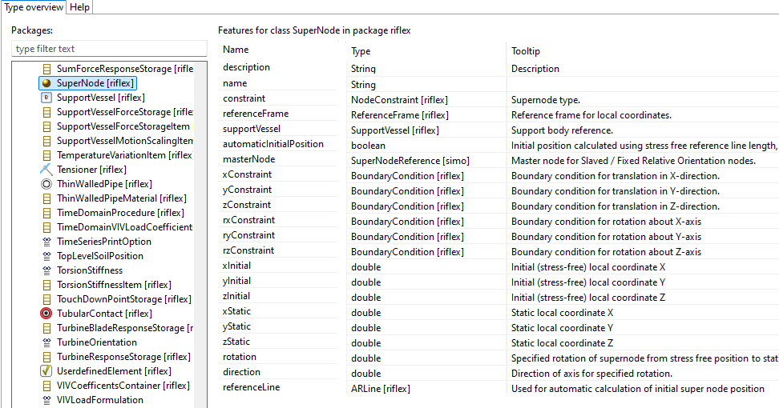


## SRE – SIMA Runtime Engine

SIMA Runtime Engine or SRE is SIMA without the user interface.
Using SRE it is possible to automate several tasks, such as running a workflow, 
importing/exporting files, etc.
It is found in the same installation folder as sima.exe.
SRE Enables running different commands in batch.

sre.exe –help all

will show all available commands

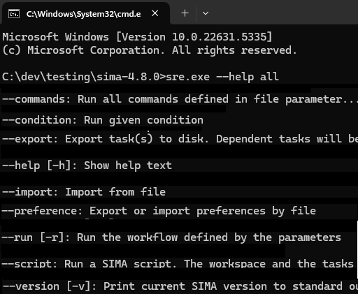

sre.exe --help <command>

will show detailed help for the given command 


### SIMA batch commands

Batch commands for SRE can also be created in SIMA main menu:
Tools - Advanced - Run SIMA batch command

This view can be used to test the commands in the current workspace.
It is possible to export the commands to the clipboard or as a file which itself can be run

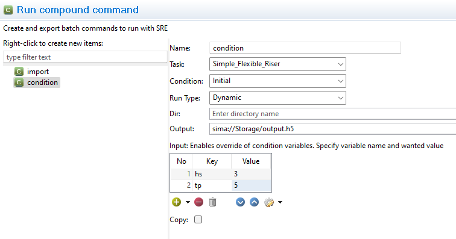


### Running SRE from SIMAPy – Example

* Using Python to make SRE:
    * Import JSON file
    * Run simulation
* Results are available as a HDF5 file

```python
import os
from pathlib import Path
from simapy.sre import SIMA
json = Path('riflex_task.json')
commands = []
# Use import command to import the json file
commands.append('--import')
commands.append('file=' + str(json.absolute()))
# Then use condition command to run dynamic analysis for the given condition
commands.append('--condition')
commands.append('task=Simple_Flexible_Riser')
commands.append('condition=Initial')
commands.append('runType=dynamic')
# Set variable values
commands.append('input=hs=3;tp=5')
# Set output file to export results to
output = Path('output.h5')
commands.append('output=' + str(output.absolute()))


# Requires that the environment is set, but an 
# alternative path may be given
exe = os.getenv('SRE_EXE')
sima = SIMA(exe=exe)
sima.run('.', commands)
```
## Results

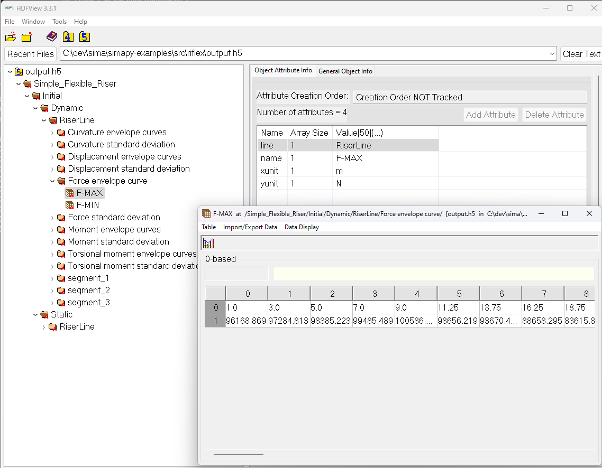

The resulting h5 file can be read in Python using the h5py library.

```python
import h5py
import matplotlib.pyplot as plt

with h5py.File('output.h5', 'r') as f:
    # Get FMAX signal in the h5 file
    fmax=f['Simple_Flexible_Riser']['Initial']["Dynamic"]["RiserLine"]["Force envelope curve"]["F-MAX"]
    plt.figure(figsize=(10, 5))  # Make the plot wider
    plt.plot(fmax[0,:], fmax[1,:], marker='o')
    plt.title("F-MAX")
    plt.xlabel("Distance along the line [m]")
    plt.ylabel("F-MAX [N]")
    plt.tight_layout()
    plt.savefig("fmax.png")

```

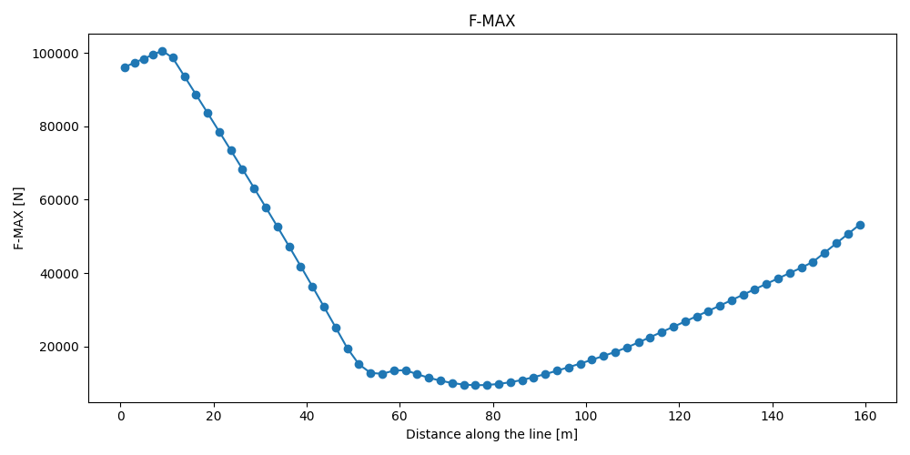

