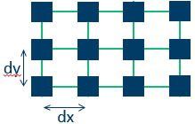
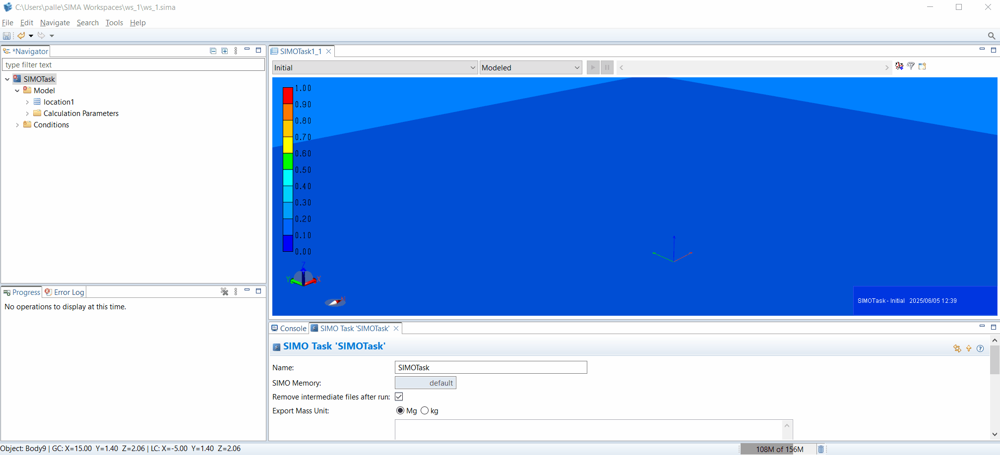

Use SIMAPy to create a grid of connected bodies



```{literalinclude} ../../src/simo/create_connected_bodies.py
:language: python
:linenos:
:caption: create_connected_bodies.py
```





# Create Connected Bodies

```{eval-rst}
.. automodule:: src.simo.create_connected_bodies
   :members:
   :undoc-members:
   :show-inheritance:
```

## Source Code

```{literalinclude} ../../src/simo/create_connected_bodies.py
:language: python
:linenos:
:caption: create_connected_bodies.py
```
